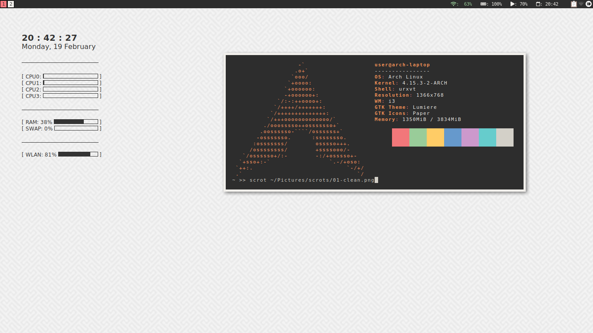
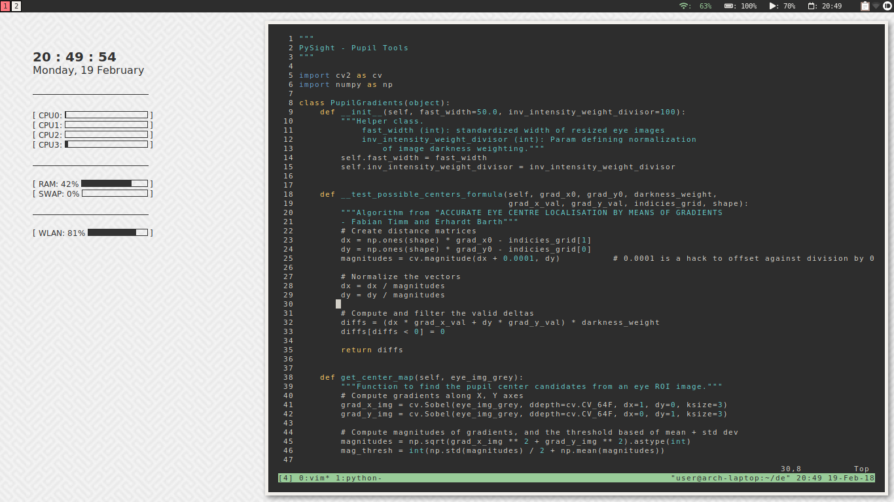

# Dotfiles

### Arch Laptop i3wm

---

##### Preview

Clean.


Editor.


##### Installed Programs

| Program/Package | Purpose | Source |
|-----------------|---------|--------|
| i3wm | Window Manager | AUR |
| feh | Photo viewer/wallpaper | AUR |
| urxvt | Terminal | AUR |
| tmux | Terminal Emulator | ? |
| conky | Heads Up Display | AUR |
| pamac-\* | Updates | AUR? |
| Transmission | Torrents | ? |
| PcManFM | File Manager | ? |
| lxsession | LX Settings | ? |
| compton | Window Compositor | ? |
| dunst | Notifications | ? |
| dmenu | Launcher | ? |
| PB for Desktop | Pushbullet: messaging + universal notifications | Yaourt |
| xbacklight | Monitor Brightness manager | AUR |
| Skippy-XD | Window Switcher | Yaourt |
| Lumiere | GTK Theme | Yaourt |
| Paper Theme | GTK Theme | Yaourt |
| Paper Icons | GTK Icons | Yaourt |
| Anaconda | Python Distribution | Online |
| Node.js | NodeJS Distribution | Yaourt |
| Visual Studio Code | Coding IDE | Yaourt |
| Sublime 3 (`sublime-text-dev`) | Text Editor | Yaourt |


##### Directory Layout

```
.
├── bin
│   └── .local
│       └── bin
│           ├── bootstrap
│           │   └── aur-pkglist.txt
│           ├── colors
│           │   ├── blocks1
│           │   ├── hex
│           │   ├── hex-block
│           │   ├── panes
│           │   └── spectrum
│           ├── dmenu-launcher.sh
│           ├── dmenu.sh
│           └── install-stow.sh
├── code
│   └── .config
│       └── Code
│           └── User
│               ├── keybindings.json
│               └── settings.json
├── compton
│   └── .config
│       └── compton
│           └── compton.conf
├── conky
│   └── .config
│       └── conky
│           └── conky.conf
├── dunst
│   └── .config
│       └── dunst
│           └── dunstrc
├── gtk
│   ├── .config
│   │   └── gtk-3.0
│   │       └── settings.ini
│   └── .gtkrc-2.0
├── home
│   ├── .bashrc
│   ├── .tmux.conf
│   ├── .Xmodmap
│   └── .Xresources
├── i3
│   └── .config
│       └── i3
│           ├── config
│           └── i3status.conf
├── jupyter
│   └── .jupyter
│       └── custom
│           ├── custom.css
│           └── custom.js
├── mozilla
├── neofetch
│   └── .config
│       └── neofetch
│           └── config.conf
├── pcmanfm
│   └── .config
│       └── pcmanfm
│           └── default
│               └── pcmanfm.conf
├── README.md
├── sublime
│   └── .config
│       └── sublime-text-3
│           └── Packages
│               └── User
│                   ├── Default (Linux).sublime-keymap
│                   └── Preferences.sublime-settings
├── tree.txt
├── vim
│   ├── .vim
│   │   └── colors
│   │       └── termscheme.vim
│   └── .vimrc
├── wallpapers
│   └── Pictures
│       └── patterns
│           ├── congruent_pentagon.png
│           ├── darkness.png
│           ├── hypnotize.png
│           ├── low_contrast_linen.png
│           ├── memphis-colorful.png
│           ├── old_map.png
│           ├── ps_neutral.png
│           ├── pw_maze_white.png
│           ├── sativa.png
│           ├── topography.png
│           └── wormz.png
└── zathura
    └── .config
        └── zathura
            └── zathurarc
```
