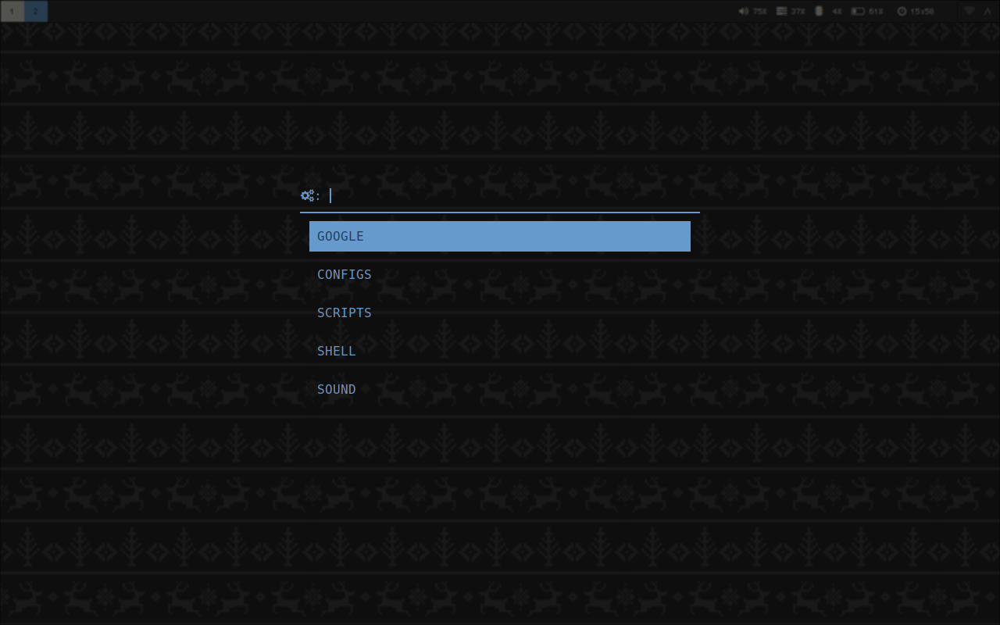

# Dotfiles

*Macbook Pro (2011)*

### Preview

Clean.

Floating.

Editing.

*Browser.* Firefox with custom start/new tab pages.

Office.

Launchers.

### Installed Programs

| | |
|---|---|
| OS | Arch Linux |
| Window Manager | I3 |
| Compositor | Compton |
| Terminal | URxvt |
| Terminal Font | Gohu Font @ `11px, -4 letterSpacing` |
| Shell | zsh |
| Prompt | blox-theme-zsh |
| Info | neofetch |
| File Manager | Thunar |
| Notifications | Dunst |
| GTK[2/3] Theme | Materia-dark-compact |
| GTK[2/3] Icons | Paper |
| Status Bar | Polybar |
| Launcher | Rofi |
| PDF Viewer | Zathura |
| Editor | VS Code, Vim |